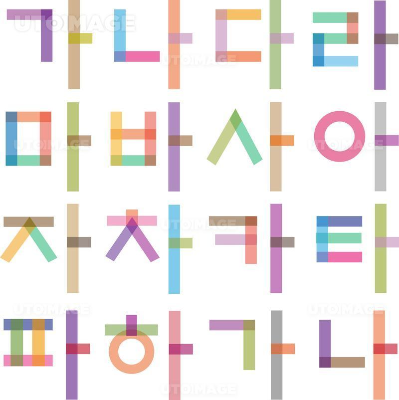

**[공지사항]** [저녁장소 안내 드립니다.: 이명훈, 박재현, 오화영 @코다리 식당](https://map.naver.com/v5/search/%EB%AA%85%ED%83%9C%EB%AA%85%EA%B0%80/place/1609534470?c=14321746.5821145,4198065.9428567,13,0,0,0,dha&placePath=%3Fentry%253Dbmp)
{: .notice--danger}

<!-- 

<h4>[공지사항]</h4>
<ul>
    <li>[01/15일 6시 밥먹자: 이명훈, 박재현, 오화영 @코다리 식당](https://map.naver.com/v5/search/%EB%AA%85%ED%83%9C%EB%AA%85%EA%B0%80/place/1609534470?c=14321746.5821145,4198065.9428567,13,0,0,0,dha&placePath=%3Fentry%253Dbmp)</li>
    <li>공지사항 순서 2</li>
    <li>공지사항 순서 3</li>
</ul>

 -->

# 오늘 처음 블로그를 만들었습니다.

개인적으로 역사적인 순간이네요.
첫 블로그 포스팅!

## 이미지 목차

### 이미지 세부목차1

이미지1

### 이미지 세부목차2

이미지2

### 이미지 세부목차3

이미지3

