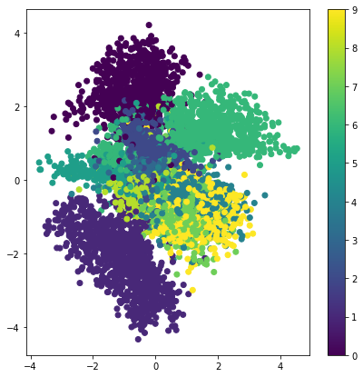

## GAN시작하기

### 판별자 훈련하기
 - 훈련 데이터셋에서 랜덤하게 진짜 샘플x를 선택합니다.
 - 새로운 랜던함 잡음 벡터 z를 넣어 생성자 네트워크를 이용해 가짜 샘플 x'를 합성한다.
 - 판별자 네트워크를 이용해 x와 x*을 분류한다.
 - 분류 오차를 계산하고 전체오차를 역전파해서 판별자의 훈련가능한 파라미터를 업데이트하고 분류 오차를 최소화 한다.
 
 
### 생성자 훈련하기
 - 생성자 네트워크를 사용해 새로운 랜덤한 잡음 벡터z에서 가짜 샘플x*을 합성합니다. 
 - 판별자 네트워크를 이용해 x*을 분류한다. 
 - 분류 오차를 계산하고 역전파해서 생성자의 훈련 가능한 파라미터를 업데이트하고 판별자의 오차를 최대화 한다. 

## VAE 변이형 오토인코더


```python
from tensorflow.keras.layers import Input, Dense, Lambda
from tensorflow.keras.models import Model
from tensorflow.keras import backend as K
from tensorflow.keras import metrics
from tensorflow.keras.datasets import mnist
from scipy.stats import norm
import numpy as np

# 하이퍼파라메터 설정
batch_size = 100
original_dim = 784
latent_dim = 2 
intermediate_dim = 256
epochs = 50
epsilon_std = 1.0

# 샘플링 함수 
def sampling(args:tuple):
    z_mean, z_log_var = args
    epsilon = K.random_normal(shape= (K.shape(z_mean)[0],latent_dim), mean=0, stddev=epsilon_std)
    return z_mean + K.exp(z_log_var/2)*epsilon

# 인코더 만들기
x =Input(shape=(original_dim,),name='input')
h = Dense(intermediate_dim,activation='relu', name='encoding')(x)
z_mean = Dense(latent_dim, name='mean')(h)
z_log_var = Dense(latent_dim, name='log-variance')(h)
z = Lambda(sampling, output_shape=(latent_dim,))([z_mean, z_log_var])
encoder = Model(x, [z_mean, z_log_var, z], name='encoder')
print(encoder.summary())
print()

# 디코더 만들기
input_decoder = Input(shape=(latent_dim,), name='decoder_input')
decoder_h = Dense(intermediate_dim,activation='relu', name='decoder_h')(input_decoder)
x_decoded = Dense(original_dim, activation='sigmoid', name='flat_decoded')(decoder_h)
decoder = Model(input_decoder,x_decoded, name='decoder')
print(decoder.summary())
print()

#모델 결합
output_combined = decoder(encoder(x)[2])
vae = Model(x, output_combined, name='VAE')
print(vae.summary())
print()

# 손실함수 만들기
kl_loss = -0.5*K.sum( 1+z_log_var - K.exp(z_log_var) - K.square(z_mean), axis=-1)

vae.add_loss(K.mean(kl_loss) / 784)
vae.compile(optimizer='rmsprop', loss='binary_crossentropy')
print(vae.summary())


```

    Model: "encoder"
    __________________________________________________________________________________________________
    Layer (type)                    Output Shape         Param #     Connected to                     
    ==================================================================================================
    input (InputLayer)              [(None, 784)]        0                                            
    __________________________________________________________________________________________________
    encoding (Dense)                (None, 256)          200960      input[0][0]                      
    __________________________________________________________________________________________________
    mean (Dense)                    (None, 2)            514         encoding[0][0]                   
    __________________________________________________________________________________________________
    log-variance (Dense)            (None, 2)            514         encoding[0][0]                   
    __________________________________________________________________________________________________
    lambda_4 (Lambda)               (None, 2)            0           mean[0][0]                       
                                                                     log-variance[0][0]               
    ==================================================================================================
    Total params: 201,988
    Trainable params: 201,988
    Non-trainable params: 0
    __________________________________________________________________________________________________
    None
    
    Model: "decoder"
    _________________________________________________________________
    Layer (type)                 Output Shape              Param #   
    =================================================================
    decoder_input (InputLayer)   [(None, 2)]               0         
    _________________________________________________________________
    decoder_h (Dense)            (None, 256)               768       
    _________________________________________________________________
    flat_decoded (Dense)         (None, 784)               201488    
    =================================================================
    Total params: 202,256
    Trainable params: 202,256
    Non-trainable params: 0
    _________________________________________________________________
    None
    
    Model: "VAE"
    _________________________________________________________________
    Layer (type)                 Output Shape              Param #   
    =================================================================
    input (InputLayer)           [(None, 784)]             0         
    _________________________________________________________________
    encoder (Functional)         [(None, 2), (None, 2), (N 201988    
    _________________________________________________________________
    decoder (Functional)         (None, 784)               202256    
    =================================================================
    Total params: 404,244
    Trainable params: 404,244
    Non-trainable params: 0
    _________________________________________________________________
    None
    
    Model: "VAE"
    __________________________________________________________________________________________________
    Layer (type)                    Output Shape         Param #     Connected to                     
    ==================================================================================================
    input (InputLayer)              [(None, 784)]        0                                            
    __________________________________________________________________________________________________
    encoder (Functional)            [(None, 2), (None, 2 201988      input[0][0]                      
    __________________________________________________________________________________________________
    decoder (Functional)            (None, 784)          202256      encoder[0][2]                    
    __________________________________________________________________________________________________
    encoding (Dense)                (None, 256)          200960      input[0][0]                      
    __________________________________________________________________________________________________
    log-variance (Dense)            (None, 2)            514         encoding[0][0]                   
    __________________________________________________________________________________________________
    tf.__operators__.add_4 (TFOpLam (None, 2)            0           log-variance[0][0]               
    __________________________________________________________________________________________________
    tf.math.exp_4 (TFOpLambda)      (None, 2)            0           log-variance[0][0]               
    __________________________________________________________________________________________________
    mean (Dense)                    (None, 2)            514         encoding[0][0]                   
    __________________________________________________________________________________________________
    tf.math.subtract_8 (TFOpLambda) (None, 2)            0           tf.__operators__.add_4[0][0]     
                                                                     tf.math.exp_4[0][0]              
    __________________________________________________________________________________________________
    tf.math.square_4 (TFOpLambda)   (None, 2)            0           mean[0][0]                       
    __________________________________________________________________________________________________
    tf.math.subtract_9 (TFOpLambda) (None, 2)            0           tf.math.subtract_8[0][0]         
                                                                     tf.math.square_4[0][0]           
    __________________________________________________________________________________________________
    tf.math.reduce_sum_4 (TFOpLambd (None,)              0           tf.math.subtract_9[0][0]         
    __________________________________________________________________________________________________
    tf.math.multiply_4 (TFOpLambda) (None,)              0           tf.math.reduce_sum_4[0][0]       
    __________________________________________________________________________________________________
    tf.math.reduce_mean_4 (TFOpLamb ()                   0           tf.math.multiply_4[0][0]         
    __________________________________________________________________________________________________
    tf.math.truediv_4 (TFOpLambda)  ()                   0           tf.math.reduce_mean_4[0][0]      
    __________________________________________________________________________________________________
    add_loss_4 (AddLoss)            ()                   0           tf.math.truediv_4[0][0]          
    ==================================================================================================
    Total params: 404,244
    Trainable params: 404,244
    Non-trainable params: 0
    __________________________________________________________________________________________________
    None
    


```python
 # mnist.load_data()는 넘파이 배열로 정의된다. 
(x_train, y_train), (x_test, y_test) = mnist.load_data() 

x_train = x_train.astype('float32') / 255
x_test = x_test.astype('float32') / 255

x_train = x_train.reshape((len(x_train), np.prod(x_train.shape[1:])))
x_test = x_test.reshape((len(x_test), np.prod(x_test.shape[1:])))

print(x_train.shape)
print(x_test.shape)
```

    (60000, 784)
    (10000, 784)
    


```python
vae.fit(x_train, x_train, shuffle=True, epochs=epochs, batch_size = batch_size)
```

    Epoch 1/50
    600/600 [==============================] - 7s 8ms/step - loss: 0.2445
    Epoch 2/50
    600/600 [==============================] - 5s 8ms/step - loss: 0.2178
    Epoch 3/50
    600/600 [==============================] - 5s 8ms/step - loss: 0.2133
    Epoch 4/50
    600/600 [==============================] - 5s 8ms/step - loss: 0.2104
    Epoch 5/50
    600/600 [==============================] - 5s 8ms/step - loss: 0.2083
    Epoch 6/50
    600/600 [==============================] - 5s 9ms/step - loss: 0.2066
    Epoch 7/50
    600/600 [==============================] - 5s 9ms/step - loss: 0.2051
    Epoch 8/50
    600/600 [==============================] - 5s 9ms/step - loss: 0.2038
    Epoch 9/50
    600/600 [==============================] - 5s 9ms/step - loss: 0.2026A: 0s - loss: 
    Epoch 10/50
    600/600 [==============================] - 5s 9ms/step - loss: 0.2015
    Epoch 11/50
    600/600 [==============================] - 5s 9ms/step - loss: 0.2005
    Epoch 12/50
    600/600 [==============================] - 5s 9ms/step - loss: 0.1997
    Epoch 13/50
    600/600 [==============================] - 5s 9ms/step - loss: 0.1989
    Epoch 14/50
    600/600 [==============================] - 5s 9ms/step - loss: 0.1983
    Epoch 15/50
    600/600 [==============================] - 5s 9ms/step - loss: 0.1977
    Epoch 16/50
    600/600 [==============================] - 5s 9ms/step - loss: 0.1973
    Epoch 17/50
    600/600 [==============================] - 5s 9ms/step - loss: 0.1968
    Epoch 18/50
    600/600 [==============================] - 5s 9ms/step - loss: 0.1964
    Epoch 19/50
    600/600 [==============================] - 5s 9ms/step - loss: 0.1960
    Epoch 20/50
    600/600 [==============================] - 5s 9ms/step - loss: 0.1957
    Epoch 21/50
    600/600 [==============================] - 5s 9ms/step - loss: 0.1954
    Epoch 22/50
    600/600 [==============================] - 5s 9ms/step - loss: 0.1951
    Epoch 23/50
    600/600 [==============================] - 5s 9ms/step - loss: 0.1948
    Epoch 24/50
    600/600 [==============================] - 5s 9ms/step - loss: 0.1945
    Epoch 25/50
    600/600 [==============================] - 5s 9ms/step - loss: 0.1943
    Epoch 26/50
    600/600 [==============================] - 5s 9ms/step - loss: 0.1940
    Epoch 27/50
    600/600 [==============================] - 5s 9ms/step - loss: 0.1938
    Epoch 28/50
    600/600 [==============================] - 5s 9ms/step - loss: 0.1936
    Epoch 29/50
    600/600 [==============================] - 5s 9ms/step - loss: 0.1934
    Epoch 30/50
    600/600 [==============================] - 5s 9ms/step - loss: 0.1932
    Epoch 31/50
    600/600 [==============================] - 6s 9ms/step - loss: 0.1930
    Epoch 32/50
    600/600 [==============================] - 5s 9ms/step - loss: 0.1928
    Epoch 33/50
    600/600 [==============================] - 5s 9ms/step - loss: 0.1926
    Epoch 34/50
    600/600 [==============================] - 5s 9ms/step - loss: 0.1924
    Epoch 35/50
    600/600 [==============================] - 5s 9ms/step - loss: 0.1923
    Epoch 36/50
    600/600 [==============================] - 5s 9ms/step - loss: 0.1922
    Epoch 37/50
    600/600 [==============================] - 5s 9ms/step - loss: 0.1920
    Epoch 38/50
    600/600 [==============================] - 5s 9ms/step - loss: 0.1919
    Epoch 39/50
    600/600 [==============================] - 5s 9ms/step - loss: 0.1917
    Epoch 40/50
    600/600 [==============================] - 5s 9ms/step - loss: 0.1916
    Epoch 41/50
    600/600 [==============================] - 5s 9ms/step - loss: 0.1914
    Epoch 42/50
    600/600 [==============================] - 5s 9ms/step - loss: 0.1913
    Epoch 43/50
    600/600 [==============================] - 5s 9ms/step - loss: 0.1912
    Epoch 44/50
    600/600 [==============================] - 5s 9ms/step - loss: 0.1911
    Epoch 45/50
    600/600 [==============================] - 5s 9ms/step - loss: 0.1909
    Epoch 46/50
    600/600 [==============================] - 5s 9ms/step - loss: 0.1908
    Epoch 47/50
    600/600 [==============================] - 5s 9ms/step - loss: 0.1907
    Epoch 48/50
    600/600 [==============================] - 5s 9ms/step - loss: 0.1906
    Epoch 49/50
    600/600 [==============================] - 5s 9ms/step - loss: 0.1905
    Epoch 50/50
    600/600 [==============================] - 5s 9ms/step - loss: 0.1904
    


    <tensorflow.python.keras.callbacks.History at 0x171b6714608>


### Latent Space내 투영된 숫자 클래스(0~9) 와 2D그래프


```python
import matplotlib.pyplot as plt

# 잠재공간내 숫자클래스 투영임으로 encoder.predict
x_test_encoded = encoder.predict(x_test, batch_size=batch_size)[0]

print(x_test_encoded.shape)
print(x_test_encoded[0:3000,1].shape)
plt.figure(figsize=(7,7))
# plt.scatter(x_test_encoded[:,0], x_test_encoded[:,1], c=y_test, cmap = 'viridis')
plt.scatter(x_test_encoded[:,0],x_test_encoded[:,1], c=y_test, cmap = 'viridis')
plt.colorbar()
# plt.legend()
```

    (10000, 2)
    (3000,)
    


    <matplotlib.colorbar.Colorbar at 0x171d863d848>


    

    


```python
# 숫자의 2D 매니폴드 출력하기
n=15
digit_size = 28
figure = np.zeros((digit_size*n, digit_size*n))

grid_x = norm.ppf(np.linspace(0.05,0.95,n)) 
grid_y = norm.ppf(np.linspace(0.05,0.95,n))


for i, yi in enumerate(grid_x):
    for j, xi in enumerate(grid_y):
        z_sample = np.array([[xi, yi]])
        x_decoded = decoder.predict(z_sample)
        digit = x_decoded[0].reshape(digit_size, digit_size)
        figure[i*digit_size:(i+1)*digit_size, 
               j*digit_size:(j+1)*digit_size] = digit
        
plt.figure(figsize=(10,10))
plt.imshow(figure, cmap='Greys_r')
plt.show
```


    <function matplotlib.pyplot.show(close=None, block=None)>


    

    


```python
np.linspace(0.05,0.95,n)
```


    array([0.05      , 0.11428571, 0.17857143, 0.24285714, 0.30714286,
           0.37142857, 0.43571429, 0.5       , 0.56428571, 0.62857143,
           0.69285714, 0.75714286, 0.82142857, 0.88571429, 0.95      ])


```python
norm.ppf(np.linspace(0.05,0.95,n)) 
```


    array([-1.64485363e+00, -1.20404696e+00, -9.20822976e-01, -6.97141435e-01,
           -5.03965367e-01, -3.28072108e-01, -1.61844167e-01, -1.39145821e-16,
            1.61844167e-01,  3.28072108e-01,  5.03965367e-01,  6.97141435e-01,
            9.20822976e-01,  1.20404696e+00,  1.64485363e+00])


```python

```


```python

```


```python

```


```python

```


```python

```


```python

```
